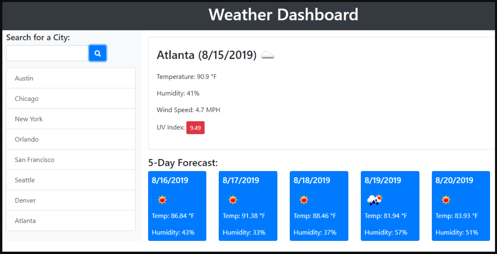

# Weather Dashboard

## Description 

A simple weather application that allows a user to search any city and a 5 day forecast will display.

## User Story

AS A traveler
I WANT to see the weather outlook for multiple cities
SO THAT I can plan a trip accordingly

### App screenshot

   

## Table of contents

- [Description](#Description)
- [Usage](#Usage)
- [Licence](#Licence)
- [Repository Link](#Repository)
- [GitHub Info](#GitHub) 

## Usage

Go to [Weather App](https://morrow7564.github.io/Weatherapp/) 

## Licence

## Repository

- [Project Repo](https://github.com/morrow7564/Weatherapp)

## GitHub

- Christopher Morrow
- [GitHub Profile](https://github.com/morrow7564)

